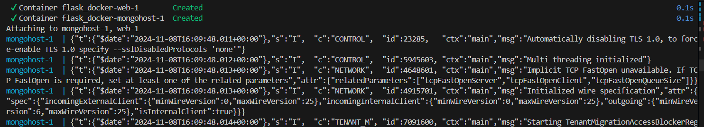
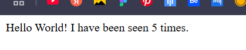

# Flask_Docker

### 1. Подготовка файлов для проекта:
Обновим app.py.
Настроим Dockerfile и docker-compose.yml, добавив сервисы для MongoDB.
### 2. Изменение кода приложения app.py:
Для хранения данных в базе данных вам нужно будет добавить зависимости, подключить Flask к базе данных, сохранить информацию о каждом запросе и включить в вывод количество запросов и время
Изменённый app.py с MongoDB
```
import time
from flask import Flask, request
from datetime import datetime
from pymongo import MongoClient

app = Flask(__name__)

# Подключение к MongoDB
client = MongoClient("mongodb://mongohost:27017/")
db = client["flaskdb"]
collection = db["requests"]

@app.route('/')
def hello():
    # Счетчик запросов
    count = collection.count_documents({})
    count += 1

    # Данные о клиенте и времени
    request_data = {
        "count": count,
        "datetime": datetime.now().strftime("%d/%b/%Y %H:%M:%S"),
        "client_info": request.headers.get("User-Agent")
    }
    
    # Сохранение данных запроса
    collection.insert_one(request_data)
    
    return 'Hello World! I have been seen {} times.\n'.format(count)
```
Здесь:

Мы подключаемся к MongoDB через MongoClient.
Создаем базу flaskdb и коллекцию requests.
В обработчике / считываем количество документов, увеличиваем счетчик и сохраняем данные о каждом запросе.

### 3 Настройка Dockerfile:
В Dockerfile добавим библиотеку pymongo для работы с MongoDB (или нужную библиотеку для работы с PostgreSQL/MySQL) в requirements.txt.
Dockerfile
```
FROM python:3.7-alpine
WORKDIR /code
ENV FLASK_APP=app.py
ENV FLASK_RUN_HOST=0.0.0.0
RUN apk add --no-cache gcc musl-dev linux-headers
COPY requirements.txt requirements.txt
RUN pip install -r requirements.txt
EXPOSE 5000
COPY . .
CMD ["flask", "run"]
```
requirements.txt
```
flask
pymongo
```
### 4 Обновление docker-compose.yml:
Заменим Redis на MongoDB.
```
version: "3.8"
services:
  web:
    build: .
    ports:
      - "5000:5000"
    volumes:
      - .:/code
    environment:
      FLASK_ENV: development
  mongohost:
    image: "mongo:latest"
    ports:
      - "27017:27017"
```
### 5 Запуск контейнеров:
``` docker-compose up --build ```


### 6 Проверка работы приложения:
Перейдите по адресу http://localhost:5000, чтобы убедиться, что приложение работает.
Счётчик должен увеличиваться при каждом обновлении страницы.
Данные запроса сохраняются в MongoDB.


